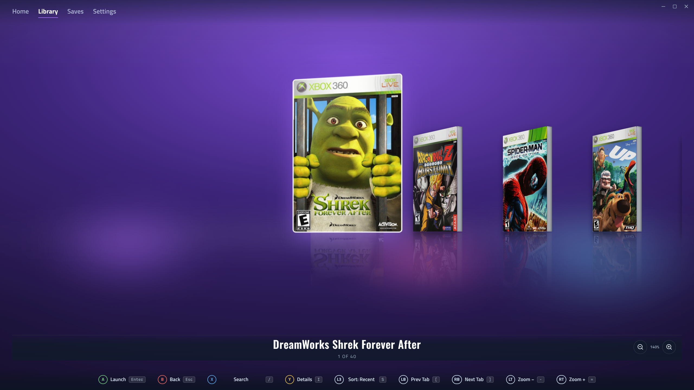
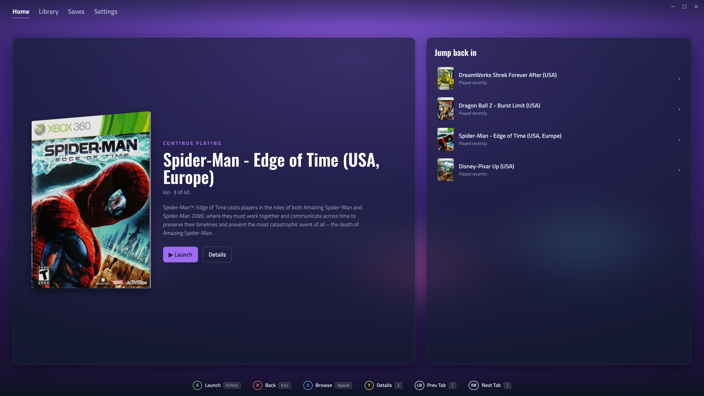
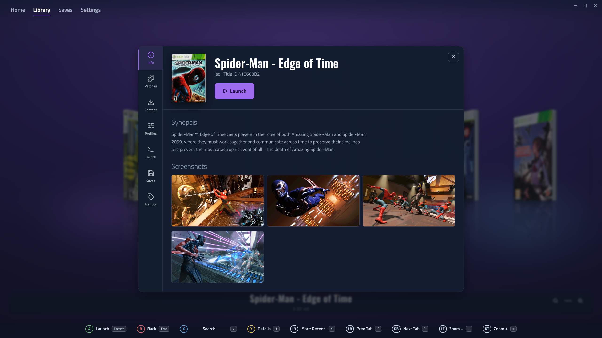
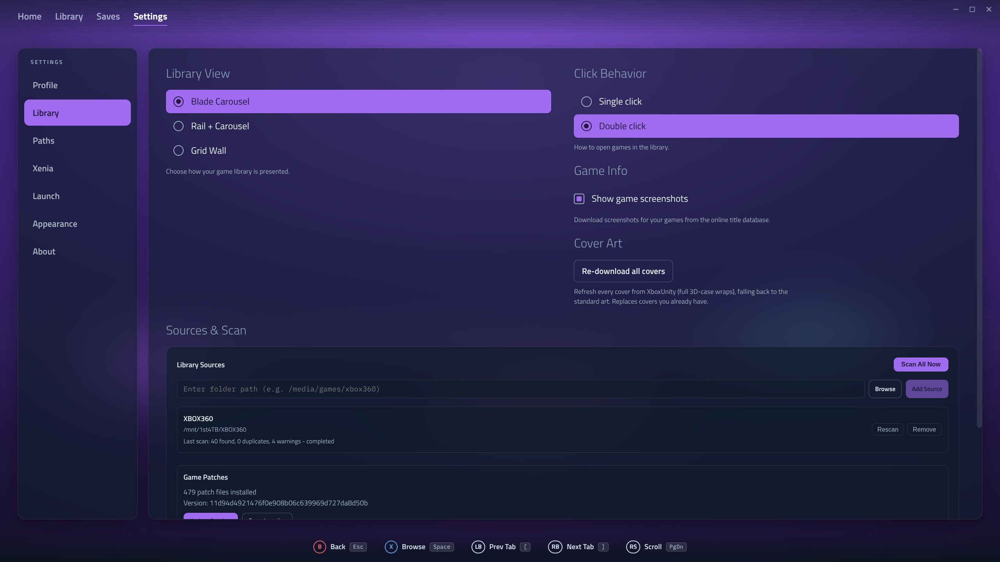

# Xenia Manager for Linux

A desktop app for running your Xbox 360 games through the
[Xenia](https://xenia.jp/) emulator on Linux, without living in a terminal or a
pile of loose folders. It keeps your library, your Xenia builds, your saves, and
your per-game tweaks in one place, and wraps the whole thing in an interface
modeled on the Xbox 360's Aurora dashboard.

It is built with Electron and React on top of a small Rust core that does the
heavy lifting (scanning, launching, talking to Xenia).

> Early days: this is a `0.1.x` release. It works, but expect rough edges, and
> please open an issue if you hit one.

## Screenshots

The library, as a coverflow of 3D cases you can steer with a controller or the
keyboard:



Home picks up where you left off:



Each game opens a details view with a synopsis and screenshots, plus tabs for
patches, extra content, launch profiles, and saves:



Settings, from library sources and scanning to cover art and how the library is
laid out:



## What it does

- **Library.** Point it at your game folders and it scans them, pulls box art
  (full 3D-case wraps from XboxUnity), and lays everything out. Three ways to
  browse: a blade carousel, a rail with carousel, or a grid wall.
- **Per-game setup.** Manage patches, title updates, and DLC, and save launch
  profiles per title, so a game boots the way you want every time.
- **Saves.** Browse and manage your game saves without digging through Xenia's
  data directory.
- **Xenia builds.** Track and switch between Xenia releases (Canary and Edge)
  from inside the app.
- **Controller-first.** The whole interface is navigable with a gamepad or the
  keyboard, including an on-screen keyboard for text entry, so it works from the
  couch.
- **Looks.** Dark and light themes, a few background palettes, and toggles for
  the 3D cover art, reflections, and motion if you'd rather keep it calm.
- **Updates itself.** Once installed, the app checks for new versions on its own
  and offers to restart into the update. No coming back here to re-download.

## Install

Grab the latest `.AppImage` from the
[Releases](https://github.com/sergen213/xenia-linux-manager/releases) page, then:

```bash
chmod +x xenia-linux-manager-*.AppImage
./xenia-linux-manager-*.AppImage
```

That's it. From then on the app updates itself in the background and lets you
know when a new version is ready.

You'll need a 64-bit Linux desktop (X11 or Wayland) and, of course, Xenia and
your own legally-owned game dumps.

## Building from source

You need Node.js and the Rust toolchain.

```bash
npm install
npm run build:sidecar   # compiles the Rust core (xlm-core)
npm run dev             # runs the app against the dev renderer
```

To produce a distributable AppImage:

```bash
npm run dist            # builds the sidecar, the app, and the AppImage into release/
```
